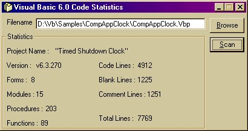



## Code Statistics

### Description

Get the statistics of your code. Find out exactly how many lines it is. It is easy to modify this project to include other file types etc.
 
### More Info
 

             |
---                |---
**Submitted On**   |2001-11-19 21:28:14
**By**             |[Eric O'Sullivan](https://github.com/Planet-Source-Code/PSCIndex/blob/master/ByAuthor/eric-o-sullivan.md)
**Level**          |Intermediate
**User Rating**    |4.1 (29 globes from 7 users)
**Compatibility**  |VB 5\.0, VB 6\.0
**Category**       |[String Manipulation](https://github.com/Planet-Source-Code/PSCIndex/blob/master/ByCategory/string-manipulation__1-5.md)
**World**          |[Visual Basic](https://github.com/Planet-Source-Code/PSCIndex/blob/master/ByWorld/visual-basic.md)
**Archive File**   |[Code\_Stati3615011192001\.zip](https://github.com/Planet-Source-Code/eric-o-sullivan-code-statistics__1-26607/archive/master.zip)

